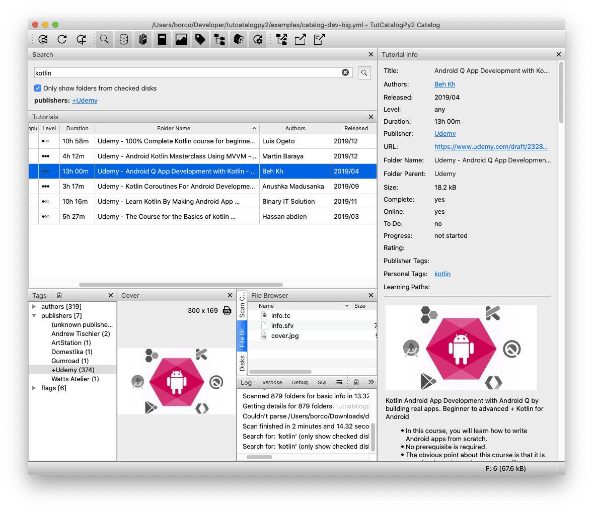

# TutCatalogPy2 (WIP)

## About

A catalog for your tutorials. Keeps a cache of the tutorials for fast access and search. Developed in Python and Qt/PySide2.

This incarnation of the TutCatalog is the fourth one, after 2 in C++ and another one in Python.

Main project repo: https://gitlab.com/iborco-software/tutcatalog/tutcatalogpy2



## Development Environment

```bash
# setup virtual environment and install dependencies
poetry install

# start the catalog
python -m tutcatalogpy.catalog

# start the viewer
python -m tutcatalogpy.viewer

# create py2app stubs
python setup-catalog.py py2app -A
# python setup-viewer.py py2app -A
```

## Notes

### Columns can't be moved

* open the .ini file
* delete the _header_state_ entries

### App crashing on start (MacOS)

**Problem:**

Got this error when setting _system_ python with _pyenv_.

**Solution:**

* set a _custom_ python with pyenv
* logout
* login

```bash
# set custom python version with pyenv
pyenv global 3.9.1
```
